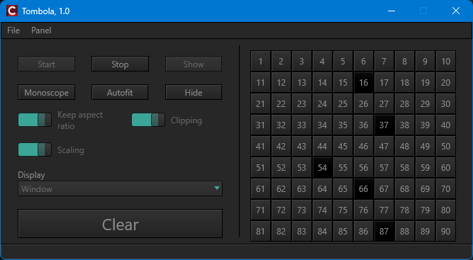
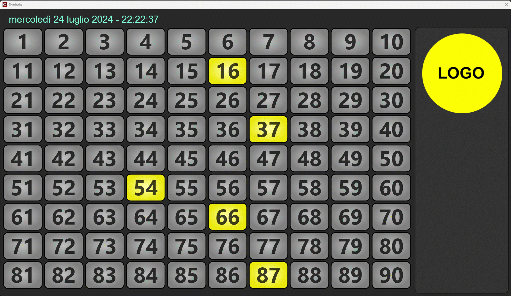

# Tabellone
Bingo (FMX)

```
git clone https://github.com/gcardi/Tabellone.git
```

> **Note:** the [Anafestica](https://github.com/gcardi/Anafestica.git) configuration
> library is no longer bundled as a submodule. It is now an **external
> prerequisite** that must be installed before building — see
> [Prerequisites](#prerequisites) below.

The control panel:



The board:



## Prerequisites

- **Embarcadero C++ Builder** (RAD Studio 12.x) with FireMonkey support.
- **[Anafestica](https://github.com/gcardi/Anafestica.git)** configuration library.

### Installing Anafestica

Anafestica is required to compile this project. Download it and install it under
`$(BDSCOMMONDIR)` following the instructions in its own repository:

```
git clone https://github.com/gcardi/Anafestica.git
```

Copy/deploy the library into `$(BDSCOMMONDIR)` (the RAD Studio common directory,
e.g. `C:\Users\Public\Documents\Embarcadero\Studio\<version>`) so that its
include and library paths are resolved by the IDE. The project no longer carries
`Anafestica\...` include/library paths inside `Tombola.cbproj`; the library is
expected to be reachable through the global RAD Studio search paths.

## Project Structure

### Main Components

```
Tabellone/
├── 📋 Forms & UI Components
│   ├── FMXFormAppMain.*      # Main application window
│   ├── FMXFormPanelBase.*    # Base panel form
│   ├── FMXWinDisplayDev.*    # Display device window
│   ├── FormMain.*            # Main control form
│   ├── FormPanel.*           # Panel form (board + configurable logo)
│   ├── FormConfig.*          # Configuration form
│   ├── FrameNum.*            # Frame for number display
│   └── DataModStyleRes.*     # Style resources data module
│
├── 📦 Core Application Code
│   ├── Tombola.cpp/h         # Main application class
│   ├── AppUtils.cpp/h        # Utility functions
│   ├── CmdLineParser.*       # Command line argument parser
│   ├── CmdLineOptions.*      # Command line options
│   ├── SyncObjsFixed.*       # Synchronization objects
│   ├── TrayIcon.cpp/h        # System tray icon
│   ├── Synchronize.h         # Thread synchronization
│   └── RegexDefs.h           # Regular expression definitions
│
├── 🎨 Resources
│   ├── AllRes.rc             # Resource file
│   └── Resources/            # Additional resources (default logo, etc.)
│
├── 📖 Documentation
│   └── docs/                 # Documentation and assets
│       └── assets/           # Images and styles
│
├── 🔧 Build Artifacts
│   ├── Win64/                # 64-bit build output (classic)
│   │   ├── Debug/
│   │   └── Release/
│   └── Win64x/               # 64-bit modern (clang) build output
│
└── ⚙️ Project Files
    ├── Tombola.cbproj        # C++ Builder project file
    ├── Tombola.twopts        # IDE options
    └── LICENSE               # License file
```

### Key Features

- **FMX-based UI**: Built with FireMonkey.
- **Bingo Game**: Complete bingo management application with control panel and display board.
- **Command-line Interface**: Support for command-line arguments and options (see below).
- **Configurable Logo**: The board logo can be replaced without rebuilding (see below).
- **Configuration Management**: Uses the Anafestica library for settings management.
- **System Tray Integration**: Runs in system tray for convenience.
- **Multi-form Architecture**: Separated concerns with dedicated forms for display, panel, and configuration.

## Using the Application

### Overview

Tombola drives a Bingo/Tombola game across **two windows**:

- the **Control Panel** (main window), used by the operator to call numbers and
  control the display;
- the **Board**, the large, audience-facing display that shows the 90 numbers,
  the currently called number, a live clock and the logo.

The Board can run **full-screen on a secondary monitor** (a projector or a TV,
for example) or in an ordinary **window**.

### Typical workflow

1. Launch `Tombola.exe`; the Control Panel opens.
2. Choose where the Board should appear from the **Display** drop-down
   (see [Display modes](#display-modes)).
3. Press **Start** (`F5`). The Board opens and the Control Panel expands to
   reveal the **1–90 keypad**.
4. As numbers are drawn, click them on the keypad. Each called number is
   highlighted on the Board and the most recent one is emphasised/animated.
5. Use **Clear** to reset the game (it asks for confirmation).
6. Press **Stop** (`F6`) to close the Board, or **Quit** to exit.

The game state (which numbers have been called), the selected display and the
options below are **persisted** between runs through the Anafestica
configuration library, so you can close and reopen without losing the current
card. Use `-session=<name>` to keep independent states (e.g. one per room).

### Control Panel

The same commands are available through the **menu bar**, on-screen
**buttons/switches**, and the **tray-icon** menu.

**File menu**

- **Start** (`F5`) — build the keypad and open the Board.
- **Stop** (`F6`) — close the Board.
- **Config…** — open the settings dialog (available only while stopped).
- **Quit** — exit the application.

**Panel menu**

- **Show** (`F9`) / **Hide** (`F10`) — show or hide the Board without stopping
  the game.
- **Monoscope** (`F12`) — toggle a test-pattern (monoscope) image on the Board,
  handy to position and calibrate the display.
- **Clipping** (`Alt+F9`), **Scaling** (`Alt+F10`),
  **Keep aspect ratio** (`Alt+F11`) — display-fitting options
  (see [Display modes](#display-modes)).
- **Autofit** (`F11`) — fit the window to its content (windowed mode only).

The **1–90 keypad** appears once the game is started: click a number to mark it
as called, click it again to un-mark it. The **Clear** button resets every
number.

### Display modes

Use the **Display** drop-down (disabled while the game is running) to choose the
Board target:

- **Window** — the Board runs in a regular, movable and resizable window.
- **&lt;monitor name&gt;** — the Board runs full-screen on the chosen monitor.
  All detected monitors are listed and the primary one is preselected.

When the Board is shown on a monitor, the following options control how its
content is fitted (they are disabled in Window mode):

- **Scaling** — scale the board content to the monitor.
- **Keep aspect ratio** — preserve proportions while scaling (avoids stretching).
- **Clipping** — clip the content to the monitor bounds.

In **Window** mode, **Autofit** resizes the window to fit its content.

### System tray

The application installs a **system-tray icon**:

- **Minimizing** the Control Panel sends the app to the tray (it disappears from
  the taskbar).
- **Double-click** the tray icon to restore the main window.
- **Right-click** the tray icon for a menu with the most common commands: Open,
  Start, Stop, Monoscope, Show, Hide, Clipping, Scaling, Keep aspect ratio,
  Autofit and Quit.

Combined with **Auto start** and **Auto minimize on tray** (see below), this lets
Tombola launch and go straight to the tray, ready to drive the Board.

### Settings (Config… dialog)

Available from **File ▸ Config…** while the game is stopped:

- **Auto start** — automatically press Start when the application launches.
- **Auto minimize on tray** — after auto-starting, minimize the Control Panel to
  the tray.

Confirm with **OK** or discard with **Cancel**.

### Keyboard shortcuts

| Shortcut   | Command                |
| ---------- | ---------------------- |
| `F5`       | Start                  |
| `F6`       | Stop                   |
| `F9`       | Show board             |
| `F10`      | Hide board             |
| `F11`      | Autofit (windowed)     |
| `F12`      | Monoscope (toggle)     |
| `Alt+F9`   | Clipping               |
| `Alt+F10`  | Scaling                |
| `Alt+F11`  | Keep aspect ratio      |

## Command-Line Options

Options are prefixed with `-`. Options that take a value use the form
`-name=value`.

| Option              | Value            | Description                                                                 |
| ------------------- | ---------------- | --------------------------------------------------------------------------- |
| `-help`             | —                | Show the help/usage message and exit.                                       |
| `-logo=<file>`      | full path        | File to use for the board logo instead of the default (see below).          |
| `-session=<name>`   | session name     | Use a separate configuration session, to keep independent settings.         |

Examples:

```
Tombola.exe -help
Tombola.exe -logo=C:\Bingo\CustomLogo.png
Tombola.exe -session=Sala2
```

## Logo Customization

The board logo (`Image1` in `FormPanel`) is resolved at startup with the
following precedence:

1. **`-logo=<file>`** command-line option, if provided and the file can be loaded.
2. **`Logo.png`** located in the same folder as the executable, if present.
3. The **default image embedded** in the form resources (fallback).

If a file does not exist or cannot be loaded (unsupported format, corrupted
file, …) the next source in the list is used. Supported image formats are
**PNG, JPEG/JPG, BMP, GIF and TIFF** (PNG is recommended because it supports
transparency).

## Technologies

- **Language**: C++
- **Framework**: FireMonkey (FMX)
- **IDE**: Embarcadero C++ Builder (RAD Studio 12.x)
- **Configuration Library**: Anafestica (external prerequisite)
- **Build Targets**: Windows 64-bit (`Win64`, `Win64x`)

## Building

The project requires Embarcadero C++ Builder with FireMonkey support and the
[Anafestica](#installing-anafestica) library installed under `$(BDSCOMMONDIR)`.

Build configurations produce their output under:
- Debug builds: `Win64/Debug/` (or `Win64x/Debug/`)
- Release builds: `Win64/Release/` (or `Win64x/Release/`)

To build the project, open `Tombola.cbproj` in C++ Builder and compile using your
preferred configuration.
